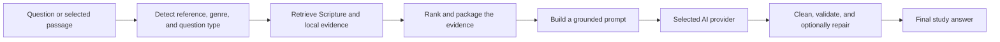

# Biblical Hermeneutics Framework (BHF)

> Read Scripture. Explore context. Ask deeper questions.

BHF is an open-source, local-first Bible study workspace built around a
hermeneutical method. It brings Scripture, literary and historical context,
original-language data, archaeology, maps, commentary, and curated research
together before an AI model is asked to explain the evidence. The model is an
optional explanation layer—not the source of the study method.

What began as a prompt framework has become a full study application: a Bible
reader, reference library, archaeology explorer, map workspace, and private
place for notes and saved studies. You can use its reading and research tools
without connecting AI, or add OpenRouter, Ollama, or another
OpenAI-compatible service when you want generated study help.

BHF teaches a process: observe, interpret in context, distinguish evidence
from inference, qualify uncertainty, and apply last. It does this without
prescribing a denomination or doctrinal conclusion.

## Install BHF

Docker is the recommended path. It starts the web app and builds the generated
reference databases for you. The first build takes longer because it prepares
the lexical and commentary data; later builds can reuse Docker's cache.

```bash
git clone https://github.com/mcscwizzy/biblical-hermeneutics-framework.git
cd biblical-hermeneutics-framework
cp .env.example .env
docker compose up -d --build
```

Open <http://localhost:8080>. At first launch, connect OpenRouter, configure a
local model, or choose **Continue Without AI**. Confirm that the app is running
at <http://localhost:8080/api/health>.

For a fully local model path using the bundled Ollama service, run:

```bash
docker compose -f docker-compose.ollama.yml up -d --build
```

See [Docker installation and operations](docs/docker.md) for prerequisites,
configuration, updates, data handling, and uninstallation.

## Other ways to use BHF

### Use the hosted website

Open the HTTPS address published by the BHF project maintainer. The repository
does not currently declare or deploy a canonical production domain, so avoid
bookmarks copied from test fixtures or old deployments.

The first-launch dialog lets you connect OpenRouter, configure a local AI
service, or continue without AI. See [Using the website and PWA](docs/web-pwa.md)
for the reader workflow, privacy boundary, installation steps, and offline
limitations.

### Build and run from source

```bash
git clone https://github.com/mcscwizzy/biblical-hermeneutics-framework.git
cd biblical-hermeneutics-framework
python3 -m venv .venv
source .venv/bin/activate
python -m pip install --upgrade pip
python -m pip install -r tools/requirements.txt
python -m pip install -e .
python -m framework.canonical_library build-db --output .bhf/ckl.sqlite
uvicorn bhf_web.app:app --reload --host 127.0.0.1 --port 8000
```

Open <http://127.0.0.1:8000>. See [Local build and development](docs/local-development.md)
for provider setup, database builds, tests, packaging, and platform-specific
virtual-environment activation.

### Use only the prompt framework

No application install is required. Copy one of the generated prompts from
[`profiles/`](profiles/) into the system instructions of ChatGPT, Claude,
Gemini, Ollama, LM Studio, or another compatible model:

- [`minimal-7b.md`](profiles/minimal-7b.md) for small context windows.
- [`standard.md`](profiles/standard.md) for balanced use.
- [`scholar.md`](profiles/scholar.md) for large context windows.

These generated profiles are independent of the application runtime, which now
uses one unified answer format.

## How BHF arrives at an answer



The important boundary is that retrieval data remains internal. Ordinary ask
responses expose validated answer prose, while developer debug routes can show
controlled retrieval metadata. The detailed component and request-flow diagrams
are in [Architecture](docs/architecture.md).

## What BHF includes today

### Study Scripture in context

- ASV and KJV Bible readers, with device-local translation import.
- Passage, literary, historical, cultural, people, places, theme,
  cross-reference, timeline, map, and translation-comparison actions.
- Greek and Hebrew word study when the generated lexical database is present.
- Tyndale Open Study Notes in a separate, attributed commentary reader.

### Explore evidence

- Curated Canonical Knowledge Library (CKL) retrieval with deterministic
  ranking and evidence packaging.
- Archaeology records for sites, artifacts, inscriptions, media, provenance,
  and related passages.
- Interactive biblical places, journeys, historical layers, manuscript, and
  political-context maps.

### Keep your work private and portable

- Notes, highlights, saved studies, map studies, and optional local session
  memory.
- Installable PWA with offline Bible reading, search, maps, reference packs,
  and device-local records.
- Encrypted study-vault backup and restore, plus optional OneDrive or iCloud
  vault sync.

### Choose how AI fits your study

- No AI connection is required for the reader and local research tools.
- OpenRouter, native Ollama, and OpenAI-compatible model adapters are
  available for generated study answers.
- A CLI, FastAPI web app, Docker Compose stacks, validation, evaluation, and
  browser-test tooling support local use and development.

AI answers are not offline merely because the PWA is installed. They still need
either an internet-accessible provider or a reachable local model runtime.

## Repository map

| Path | Purpose |
|---|---|
| `bhf_agent/` | Retrieval, prompt construction, model adapters, validation, and CLI. |
| `bhf_web/` | FastAPI UI/API, templates, browser code, service worker, and offline packs. |
| `framework/` | Hermeneutics modules, CKL objects/runtime, and lexical tooling. |
| `profiles/` | Generated copy/paste prompt profiles. |
| `docs/` | User, operator, contributor, and subsystem documentation. |
| `tools/` | Validation, composition, import, audit, and evaluation utilities. |
| `tests/` | Unit, integration, regression, and GUI coverage. |
| `examples/` | Agent configurations, fixtures, and worked examples. |

Start with the [documentation index](docs/README.md) for the complete guide map.

## Contributing

Read [CONTRIBUTING.md](CONTRIBUTING.md), the
[Neutrality Charter](GOVERNANCE.md#1-neutrality-charter-the-constitution), and
the [style guide](docs/style-guide.md) before changing framework content.

## License

- Code is licensed under [MIT](LICENSE).
- Framework content, documentation, profiles, and examples are licensed under
  [CC BY 4.0](LICENSE-CONTENT).
- Bundled translations and imported lexical sources retain their own notices
  and licenses; see [Translations](docs/translations.md) and
  [Lexicon sources](docs/lexicon-sources.md).
