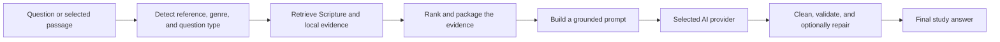

# Biblical Hermeneutics Framework (BHF)

> Teaching AI—and helping people—how to read the Bible carefully.

BHF is an open-source Bible study application and hermeneutics framework. It
retrieves Scripture, literary and historical context, lexical data, archaeology,
maps, and curated Canonical Knowledge Library (CKL) material before asking a language
model to explain the evidence. The model is the explanation layer, not the
source of the study method.

BHF teaches a process—observe, interpret in context, qualify uncertainty, and
apply last—without prescribing a denomination or doctrinal conclusion.

## Start here

Choose the path that matches how you want to use BHF.

### Use the hosted website

Open the HTTPS address published by the BHF project maintainer. The repository
does not currently declare or deploy a canonical production domain, so avoid
bookmarks copied from test fixtures or old deployments.

The first-launch dialog lets you connect OpenRouter, configure a local AI
service, or continue without AI. See [Using the website and PWA](docs/web-pwa.md)
for the reader workflow, privacy boundary, installation steps, and offline
limitations.

### Run locally with Docker

Docker is the recommended local installation because the image builds the CKL
and Greek/Hebrew lexical databases for you.

```bash
git clone https://github.com/mcscwizzy/biblical-hermeneutics-framework.git
cd biblical-hermeneutics-framework
cp .env.example .env
docker compose up -d --build
```

Open <http://localhost:8080> and verify the service at
<http://localhost:8080/api/health>.

The default stack uses browser-connected OpenRouter. To run the app and model
locally with Ollama instead:

```bash
docker compose -f docker-compose.ollama.yml up -d --build
```

See [Docker installation and operations](docs/docker.md) for setup,
configuration, upgrades, data handling, and complete uninstallation.

### Build and run from source

```bash
git clone https://github.com/mcscwizzy/biblical-hermeneutics-framework.git
cd biblical-hermeneutics-framework
python3 -m venv .venv
source .venv/bin/activate
python -m pip install --upgrade pip
python -m pip install -r tools/requirements.txt
python -m pip install -e .
python -m framework.canonical_library build-db --output .bhf/ckl.sqlite
uvicorn bhf_web.app:app --reload --host 127.0.0.1 --port 8000
```

Open <http://127.0.0.1:8000>. See [Local build and development](docs/local-development.md)
for provider setup, database builds, tests, packaging, and platform-specific
virtual-environment activation.

### Use only the prompt framework

No application install is required. Copy one of the generated prompts from
[`profiles/`](profiles/) into the system instructions of ChatGPT, Claude,
Gemini, Ollama, LM Studio, or another compatible model:

- [`minimal-7b.md`](profiles/minimal-7b.md) for small context windows.
- [`standard.md`](profiles/standard.md) for balanced use.
- [`scholar.md`](profiles/scholar.md) for large context windows.

These generated profiles are independent of the application runtime, which now
uses one unified answer format.

## How BHF arrives at an answer



The important boundary is that retrieval data remains internal. Ordinary ask
responses expose validated answer prose, while developer debug routes can show
controlled retrieval metadata. The detailed component and request-flow diagrams
are in [Architecture](docs/architecture.md).

## What is included

- ASV and KJV Bible readers, plus device-local translation import.
- Passage, literary, historical, cultural, cross-reference, timeline, map, and
  translation-comparison study actions.
- Greek and Hebrew lexical lookup when the generated lexical database is present.
- Curated CKL retrieval with deterministic ranking and evidence packaging.
- First-class Archaeology exploration with deterministic sites, artifacts,
  inscriptions, licensed media, provenance, and passage links.
- Notes, highlights, saved studies, and optional local session memory.
- Installable PWA shell with offline Bible reading, search, maps, study packs,
  and device-local records.
- OpenRouter, native Ollama, and OpenAI-compatible model adapters.
- CLI, FastAPI web application, Docker Compose stacks, validation, evaluation,
  and Selenium test tooling.

AI answers are not offline merely because the PWA is installed. They still need
either an internet-accessible provider or a reachable local model runtime.

## Repository map

| Path | Purpose |
|---|---|
| `bhf_agent/` | Retrieval, prompt construction, model adapters, validation, and CLI. |
| `bhf_web/` | FastAPI UI/API, templates, browser code, service worker, and offline packs. |
| `framework/` | Hermeneutics modules, CKL objects/runtime, and lexical tooling. |
| `profiles/` | Generated copy/paste prompt profiles. |
| `docs/` | User, operator, contributor, and subsystem documentation. |
| `tools/` | Validation, composition, import, audit, and evaluation utilities. |
| `tests/` | Unit, integration, regression, and GUI coverage. |
| `examples/` | Agent configurations, fixtures, and worked examples. |

Start with the [documentation index](docs/README.md) for the complete guide map.

## Contributing

Read [CONTRIBUTING.md](CONTRIBUTING.md), the
[Neutrality Charter](GOVERNANCE.md#1-neutrality-charter-the-constitution), and
the [style guide](docs/style-guide.md) before changing framework content.

## License

- Code is licensed under [MIT](LICENSE).
- Framework content, documentation, profiles, and examples are licensed under
  [CC BY 4.0](LICENSE-CONTENT).
- Bundled translations and imported lexical sources retain their own notices
  and licenses; see [Translations](docs/translations.md) and
  [Lexicon sources](docs/lexicon-sources.md).
