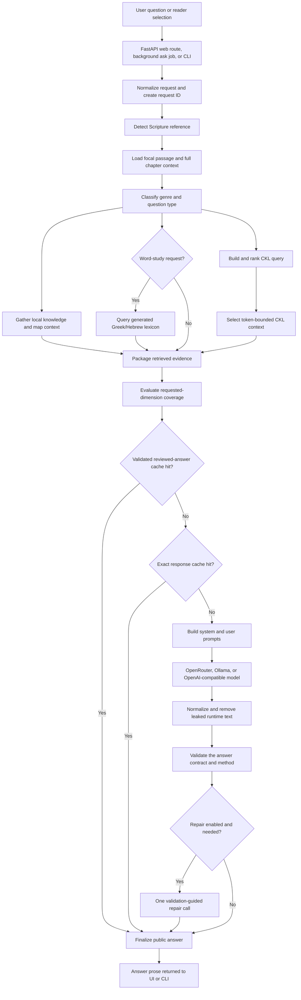
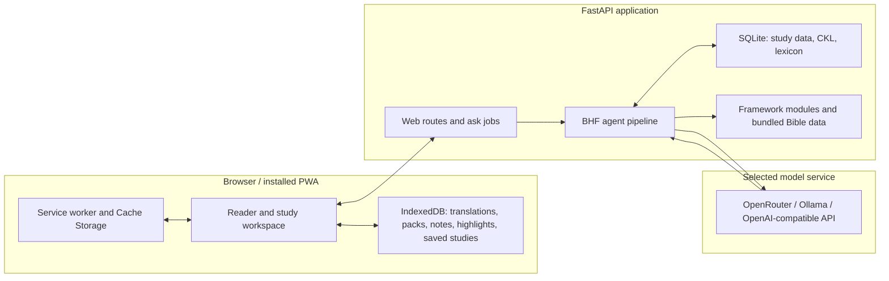

# BHF Architecture

BHF has two related products in one repository:

1. A composable Markdown hermeneutics framework that can be copied into any AI
   system prompt.
2. A Python/FastAPI application that retrieves local evidence and asks a chosen
   model to synthesize a study answer.

The application does not ask the model to discover BHF files or perform CKL
retrieval. BHF gathers and bounds the evidence first; the model explains it.

## Answer flow



Not every branch runs for every request. Lexical retrieval is limited to word
studies or explicit Strong's queries. Session memory and caches are optional.
External research is disabled by default. A model failure returns a controlled
error; it does not turn raw retrieved records into an answer.

The Bible-search fallback is a separate deterministic path. It searches local
Bible and CKL data for likely passages and returns structured suggestions
without calling a model.

## What each layer owns



The browser owns PWA caches and device-local imported translations and records.
The server owns deterministic retrieval and prompt construction. The selected
provider receives the constructed model request and returns a draft answer.

OpenRouter credentials connected through the UI are encrypted in browser
storage. The decrypted value is held in browser memory and sent to the BHF
server for the current request. It must not be written to logs, saved studies,
offline exports, or service-worker caches.

## Runtime responsibilities

| Component | Responsibility |
|---|---|
| `bhf_web/app.py` | Creates the FastAPI app, mounts assets, and exposes health, PWA, Bible, and supporting API routes. |
| `bhf_web/routes/ask.py` | Accepts synchronous and background ask requests and returns public answer prose. |
| `bhf_web/jobs.py` | Tracks in-memory request progress and runs ask or deterministic search-fallback jobs. |
| `bhf_agent/runner.py` | Orchestrates the end-to-end evidence, cache, prompt, model, cleanup, validation, repair, and result pipeline. |
| `bhf_agent/prompts.py` | Constructs the unified runtime prompt and answer contract. |
| `bhf_agent/adapters/` | Implements OpenRouter, native Ollama, and OpenAI-compatible HTTP calls. |
| `framework/canonical_library/` | Loads, ranks, validates, relates, and serializes curated CKL objects. |
| `framework/lexical/` | Builds and queries the generated lexical and verse-token database. |
| `framework/core/`, `genres/`, `books/`, `context/`, `language/` | Stores the portable Markdown hermeneutics framework. |
| `bhf_web/static/sw.js` and `offline.py` | Define the PWA shell cache and installable offline data packs. |

## Evidence boundary

Internally, the runner builds a `RetrievedEvidence` package containing selected
Scripture, immediate context, CKL objects, lexical entries, direct facts, and
references. That package can inform prompt construction but is not a public
response type.

Only validated synthesis prose becomes the final answer. Normal ask responses
do not expose CKL scores, filenames, serialized entries, prompts, or hidden
analysis. Debug routes and saved-study views may expose explicitly controlled
metadata for development or provenance.

## Knowledge and fallback behavior

CKL retrieval relevance and answer coverage are different signals:

- Retrieval relevance asks whether a CKL object matches the query.
- Answer coverage asks whether the gathered evidence addresses the dimensions
  requested by the user.

After Scripture, CKL, lexical, map, genre, and other local context are gathered,
BHF assigns one of three routing modes: CKL-primary, targeted gap expansion, or
broad knowledge expansion. Model-knowledge expansion can be disabled, and
external retrieval requires an explicitly enabled provider. Strict CKL mode
blocks both. See [Research expansion](research-expansion.md) for configuration.

## Framework module composition

The portable framework consists of Markdown files with YAML frontmatter and a
fixed-section body. The authoritative contract is
[`module-spec.md`](module-spec.md).

| Type | Folder | Role |
|---|---|---|
| `core` | `framework/core/` | Always-on interpretive posture. |
| `genre` | `framework/genres/` | Guidance for a literary genre. |
| `book` | `framework/books/` | Guidance for a biblical book. |
| `context` | `framework/context/` | Historical, cultural, literary, and social context. |
| `language` | `framework/language/` | Original-language and literary-device guidance. |
| `profile` | `profiles/` | Generated bundles for copy/paste use. |

`tools/compose.py` resolves transitive `requires` dependencies, applies core
inclusions, topologically orders modules, and concatenates them within a token
budget. `tools/validate.py` verifies the schema, dependency graph, links, and
generated profiles.

```text
selected modules -> dependency closure -> stable topological order -> prompt
```

The generated prompt profiles remain useful outside the application. The
application's agent path now uses a compact unified runtime prompt and retains
legacy profile and answer-mode values only for compatibility.

## Storage and process boundaries

- `.bhf/study.sqlite` stores server-side study data in a source checkout.
- `.bhf/ckl.sqlite` is the generated local CKL database.
- `framework/lexical/database/lexicon.sqlite` is the default source-run lexical
  database; Docker uses `.bhf/lexicon.sqlite` on the host mount.
- `.bhf/sessions/` stores optional local agent memory.
- Browser IndexedDB and Cache Storage contain PWA data for that browser profile.
- Background ask-job progress is process memory and disappears on restart.

All `.bhf/` data is ignored by Git. A Docker volume must mount at
`/app/.bhf-data`, not `/app/.bhf`, because the image-owned `/app/.bhf/ckl.sqlite`
would otherwise be hidden.

## Deployment boundary

The supplied Compose files are intended for localhost or a trusted LAN. The app
does not provide user accounts, authentication, rate limiting, or general
public-internet hardening. A public deployment needs an HTTPS reverse proxy and
the operator's own authentication, abuse controls, monitoring, backup, and
secret-management plan.

## Versioning

BHF uses two levels of semantic versioning:

- Framework version (`VERSION`, `CHANGELOG.md`): major for a breaking module
  contract or core-method change, minor for new modules or sections, and patch
  for corrections.
- Per-module `version` frontmatter: tracks an individual module independently.

Module lifecycle uses `draft`, `review`, `stable`, and `deprecated`. Releases
are Git tags such as `v0.2.0`.
