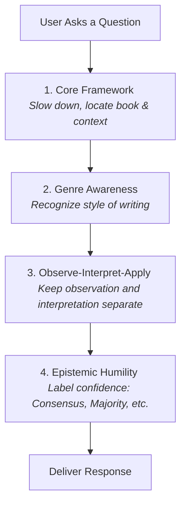

# Roadmap of the Minimal-7B Profile Instruction Set

The file [minimal-7b.md](file:///home/johnwalker/Documents/github/biblical-hermeneutics-framework/profiles/minimal-7b.md) is a simplified, lightweight version of the Biblical Hermeneutics Framework (~2,483 tokens, 245 lines). It contains **4 core modules** and is optimized for smaller language models (such as 7B-parameter models) that have limited context windows or reasoning capacities.

---

## Profile Structure

The Minimal-7B profile includes only the most critical modules necessary to prevent major interpretive errors.

---

## Module Breakdown

1. **`core.core-framework` (Lines 11-73):** Sets the default posture for the system, forcing it to work from context toward meaning, separate the steps, and leave theological conclusions to the reader.
2. **`core.genre-awareness` (Lines 76-138):** Instructs the system to identify the style of text (poetry, letter, history, etc.) before explaining it.
3. **`core.observe-interpret-apply` (Lines 141-192):** Enforces a strict separation between observing what is written, interpreting what it meant originally, and applying it today.
4. **`core.epistemic-humility` (Lines 195-245):** Dictates how the system labels its certainty about findings (Consensus, Majority, Minority, or Speculation).

---

## Sitemap & Index of `minimal-7b.md`

Use this index to navigate the file:

| Module ID | Title | Start Line | End Line |
| :--- | :--- | :--- | :--- |
| **`core.core-framework`** | [Core Hermeneutic Framework](file:///home/johnwalker/Documents/github/biblical-hermeneutics-framework/profiles/minimal-7b.md#L11-L73) | Line 11 | Line 73 |
| **`core.genre-awareness`** | [Genre Awareness](file:///home/johnwalker/Documents/github/biblical-hermeneutics-framework/profiles/minimal-7b.md#L76-L138) | Line 76 | Line 138 |
| **`core.observe-interpret-apply`** | [Observation, Interpretation, Application](file:///home/johnwalker/Documents/github/biblical-hermeneutics-framework/profiles/minimal-7b.md#L141-L192) | Line 141 | Line 192 |
| **`core.epistemic-humility`** | [Epistemic Humility and Confidence Labels](file:///home/johnwalker/Documents/github/biblical-hermeneutics-framework/profiles/minimal-7b.md#L195-L245) | Line 195 | Line 245 |
