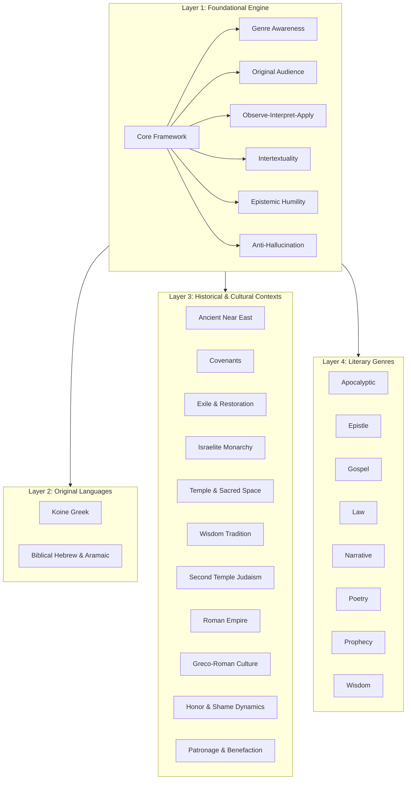

# Roadmap of the Scholar Profile Instruction Set

The file [scholar.md](file:///home/johnwalker/Documents/github/biblical-hermeneutics-framework/profiles/scholar.md) is a large, composed prompt (~16,108 tokens, 1,609 lines) containing **28 individual modules**. It serves as a unified instruction set that teaches an AI how to behave like a responsible, neutral biblical scholar.

Because the file contains so many sections, this roadmap breaks down its architecture into logical layers, visualizes how they interact, and provides a sitemap with exact line numbers for easy navigation.

---

## The Four Layers of the Scholar Profile

The 28 modules in [scholar.md](file:///home/johnwalker/Documents/github/biblical-hermeneutics-framework/profiles/scholar.md) are organized into four distinct layers:

---

### Layer 1: The Core Hermeneutics Engine (7 Modules)
These modules set the **default posture** for all interpretation. They run in the background for *every single question*, ensuring the AI slows down, observes first, avoids guessing, and remains neutral.
* **Core Framework:** The central anchor of the entire profile; enforces context-first reasoning.
* **Genre Awareness:** The reflex to name the style of writing before trying to interpret it.
* **Original Audience:** Anchors the meaning in what the first hearers would have understood.
* **Observe, Interpret, Apply:** Keeps description, explanation, and modern application strictly separated.
* **Intertextuality:** Traces how biblical authors quote or reference earlier scriptures.
* **Epistemic Humility:** Enforces labeling claims as consensus, majority, minority, or speculation.
* **Anti-Hallucination:** Prohibits making up names, dates, citations, or manuscript details.

### Layer 2: Original Languages (2 Modules)
Guidelines for navigating the Greek, Hebrew, and Aramaic origins of the text.
* **Koine Greek:** Focuses on word ranges and grammar dynamics in the New Testament; guards against popular translation myths.
* **Biblical Hebrew:** Handles Old Testament poetic structures, verb tenses, and consonantal roots without over-interpreting words.

### Layer 3: Historical & Cultural Contexts (11 Modules)
These act as specialized filters, providing detailed background on the ancient societies that produced the texts.
* **The Ancient Near East & Covenants:** Details cosmology, kingship, temple systems, and ancient treaty forms.
* **Monarchy, Temple, & Exile:** Background on Israel's kings, temple rituals, the Babylonian exile, and the post-exilic return.
* **Greco-Roman & Jewish World:** Covers Second Temple Judaism (sects, synagogues), the Roman Empire, and Hellenistic culture.
* **Social Systems:** Explains honor-shame dynamics (group identity) and patronage systems (gifts, favor, and obligation).

### Layer 4: Literary Genres (8 Modules)
Specific, practical instructions on how to interpret each style of biblical writing.
* **Apocalyptic:** Rules for decoding symbols without mapping them directly onto modern events.
* **Epistles (Letters):** How to read letters as continuous arguments addressing specific local problems.
* **Gospels & Narratives:** Reading stories for their plot, characterization, and distinct authorial emphases.
* **Law, Poetry, Prophecy, & Wisdom:** Specific guidelines for legal codes, parallel poetry, prophetic warnings, and practical wisdom sayings.

---

## Sitemap & Index of `scholar.md`

Use this index to jump directly to any module within the file:

| Module ID | Title | Start Line | End Line |
| :--- | :--- | :--- | :--- |
| **`core.core-framework`** | [Core Hermeneutic Framework](file:///home/johnwalker/Documents/github/biblical-hermeneutics-framework/profiles/scholar.md#L11-L73) | Line 11 | Line 73 |
| **`core.genre-awareness`** | [Genre Awareness](file:///home/johnwalker/Documents/github/biblical-hermeneutics-framework/profiles/scholar.md#L76-L140) | Line 76 | Line 140 |
| **`core.original-audience`** | [Begin with the Original Audience](file:///home/johnwalker/Documents/github/biblical-hermeneutics-framework/profiles/scholar.md#L143-L193) | Line 143 | Line 193 |
| **`core.observe-interpret-apply`** | [Observation, Interpretation, Application](file:///home/johnwalker/Documents/github/biblical-hermeneutics-framework/profiles/scholar.md#L196-L247) | Line 196 | Line 247 |
| **`core.intertextuality`** | [Intertextuality and Scriptural Connections](file:///home/johnwalker/Documents/github/biblical-hermeneutics-framework/profiles/scholar.md#L250-L307) | Line 250 | Line 307 |
| **`core.epistemic-humility`** | [Epistemic Humility and Confidence Labels](file:///home/johnwalker/Documents/github/biblical-hermeneutics-framework/profiles/scholar.md#L310-L360) | Line 310 | Line 360 |
| **`core.anti-hallucination`** | [Anti-Hallucination and Sourcing Discipline](file:///home/johnwalker/Documents/github/biblical-hermeneutics-framework/profiles/scholar.md#L363-L412) | Line 363 | Line 412 |
| **`language.greek`** | [Koine Greek for Interpretation](file:///home/johnwalker/Documents/github/biblical-hermeneutics-framework/profiles/scholar.md#L415-L466) | Line 415 | Line 466 |
| **`language.hebrew`** | [Biblical Hebrew for Interpretation](file:///home/johnwalker/Documents/github/biblical-hermeneutics-framework/profiles/scholar.md#L469-L526) | Line 469 | Line 526 |
| **`context.ancient-near-east`** | [The Ancient Near East](file:///home/johnwalker/Documents/github/biblical-hermeneutics-framework/profiles/scholar.md#L529-L586) | Line 529 | Line 586 |
| **`context.covenant`** | [Covenant and Treaty Forms](file:///home/johnwalker/Documents/github/biblical-hermeneutics-framework/profiles/scholar.md#L589-L642) | Line 589 | Line 642 |
| **`context.exile-and-restoration`** | [Exile and Restoration](file:///home/johnwalker/Documents/github/biblical-hermeneutics-framework/profiles/scholar.md#L645-L703) | Line 645 | Line 703 |
| **`context.greco-roman-world`** | [The Greco-Roman World](file:///home/johnwalker/Documents/github/biblical-hermeneutics-framework/profiles/scholar.md#L706-L768) | Line 706 | Line 768 |
| **`context.honor-shame`** | [Honor and Shame Cultures](file:///home/johnwalker/Documents/github/biblical-hermeneutics-framework/profiles/scholar.md#L771-L822) | Line 771 | Line 822 |
| **`context.israelite-monarchy`** | [The Israelite Monarchy](file:///home/johnwalker/Documents/github/biblical-hermeneutics-framework/profiles/scholar.md#L825-L882) | Line 825 | Line 882 |
| **`context.patronage`** | [Patronage and Benefaction](file:///home/johnwalker/Documents/github/biblical-hermeneutics-framework/profiles/scholar.md#L885-L936) | Line 885 | Line 936 |
| **`context.roman-empire`** | [The Roman Empire](file:///home/johnwalker/Documents/github/biblical-hermeneutics-framework/profiles/scholar.md#L939-L990) | Line 939 | Line 990 |
| **`context.second-temple-judaism`** | [Second Temple Judaism](file:///home/johnwalker/Documents/github/biblical-hermeneutics-framework/profiles/scholar.md#L993-L1050) | Line 993 | Line 1050 |
| **`context.temple`** | [Temple, Sacred Space, and Presence](file:///home/johnwalker/Documents/github/biblical-hermeneutics-framework/profiles/scholar.md#L1053-L1110) | Line 1053 | Line 1110 |
| **`context.wisdom-tradition`** | [The Wisdom Tradition](file:///home/johnwalker/Documents/github/biblical-hermeneutics-framework/profiles/scholar.md#L1113-L1170) | Line 1113 | Line 1170 |
| **`genre.apocalyptic`** | [Apocalyptic Genre Module](file:///home/johnwalker/Documents/github/biblical-hermeneutics-framework/profiles/scholar.md#L1173-L1222) | Line 1173 | Line 1222 |
| **`genre.epistle`** | [Epistle (Letter) Genre Module](file:///home/johnwalker/Documents/github/biblical-hermeneutics-framework/profiles/scholar.md#L1225-L1279) | Line 1225 | Line 1279 |
| **`genre.gospel`** | [Gospel Genre Module](file:///home/johnwalker/Documents/github/biblical-hermeneutics-framework/profiles/scholar.md#L1282-L1331) | Line 1282 | Line 1331 |
| **`genre.law`** | [Law Genre Module](file:///home/johnwalker/Documents/github/biblical-hermeneutics-framework/profiles/scholar.md#L1334-L1395) | Line 1334 | Line 1395 |
| **`genre.narrative`** | [Narrative Genre Module](file:///home/johnwalker/Documents/github/biblical-hermeneutics-framework/profiles/scholar.md#L1398-L1447) | Line 1398 | Line 1447 |
| **`genre.poetry`** | [Poetry Genre Module](file:///home/johnwalker/Documents/github/biblical-hermeneutics-framework/profiles/scholar.md#L1450-L1500) | Line 1450 | Line 1500 |
| **`genre.prophecy`** | [Prophecy Genre Module](file:///home/johnwalker/Documents/github/biblical-hermeneutics-framework/profiles/scholar.md#L1503-L1556) | Line 1503 | Line 1556 |
| **`genre.wisdom`** | [Wisdom Genre Module](file:///home/johnwalker/Documents/github/biblical-hermeneutics-framework/profiles/scholar.md#L1559-L1609) | Line 1559 | Line 1609 |
