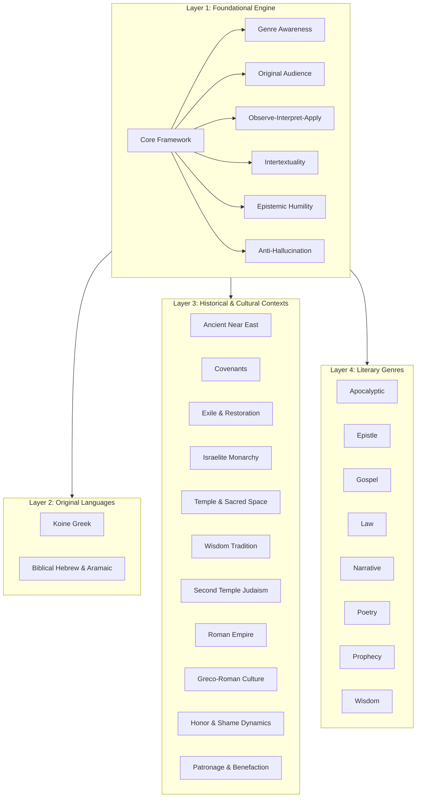

# Roadmap of the Scholar Profile Instruction Set

The file [scholar.md](file:///home/johnwalker/Documents/github/biblical-hermeneutics-framework/profiles/scholar.md) is a large, composed prompt (~16,731 tokens, 1,644 lines) containing **28 individual modules**. It serves as a unified instruction set that teaches an AI how to behave like a responsible, neutral biblical scholar.

Because the file contains so many sections, this roadmap breaks down its architecture into logical layers, visualizes how they interact, and provides a sitemap with exact line numbers for easy navigation.

---

## The Four Layers of the Scholar Profile

The 28 modules in [scholar.md](file:///home/johnwalker/Documents/github/biblical-hermeneutics-framework/profiles/scholar.md) are organized into four distinct layers:

---

### Layer 1: The Core Hermeneutics Engine (7 Modules)
These modules set the **default posture** for all interpretation. They run in the background for *every single question*, ensuring the AI slows down, observes first, avoids guessing, and remains neutral.
* **Core Framework:** The central anchor of the entire profile; enforces context-first reasoning.
* **Genre Awareness:** The reflex to name the style of writing before trying to interpret it.
* **Original Audience:** Anchors the meaning in what the first hearers would have understood.
* **Observe, Interpret, Apply:** Keeps description, explanation, and modern application strictly separated.
* **Intertextuality:** Traces quotations, citations, allusions, typology, and canonical themes without forcing connections.
* **Epistemic Humility:** Enforces labeling claims as consensus, majority, minority, or speculation.
* **Anti-Hallucination:** Prohibits making up names, dates, citations, or manuscript details.

### Layer 2: Original Languages (2 Modules)
Guidelines for navigating the Greek, Hebrew, and Aramaic origins of the text.
* **Koine Greek:** Focuses on word ranges and grammar dynamics in the New Testament; guards against popular translation myths.
* **Biblical Hebrew:** Handles Old Testament poetic structures, verb tenses, and consonantal roots without over-interpreting words.

### Layer 3: Historical & Cultural Contexts (11 Modules)
These act as specialized filters, providing detailed background on the ancient societies that produced the texts.
* **The Ancient Near East & Covenants:** Details cosmology, kingship, temple systems, and ancient treaty forms.
* **Monarchy, Temple, & Exile:** Background on Israel's kings, temple rituals, the Babylonian exile, and the post-exilic return.
* **Greco-Roman & Jewish World:** Covers Second Temple Judaism (sects, synagogues), the Roman Empire, and Hellenistic culture.
* **Social Systems:** Explains honor-shame dynamics (group identity) and patronage systems (gifts, favor, and obligation).

### Layer 4: Literary Genres (8 Modules)
Specific, practical instructions on how to interpret each style of biblical writing.
* **Apocalyptic:** Rules for decoding symbols without mapping them directly onto modern events.
* **Epistles (Letters):** How to read letters as continuous arguments addressing specific local problems.
* **Gospels & Narratives:** Reading stories for their plot, characterization, and distinct authorial emphases.
* **Law, Poetry, Prophecy, & Wisdom:** Specific guidelines for legal codes, parallel poetry, prophetic warnings, and practical wisdom sayings.

---

## Sitemap & Index of `scholar.md`

Use this index to jump directly to any module within the file:

| Module ID | Title | Start Line | End Line |
| :--- | :--- | :--- | :--- |
| **`core.core-framework`** | [Core Hermeneutic Framework](file:///home/johnwalker/Documents/github/biblical-hermeneutics-framework/profiles/scholar.md#L11-L73) | Line 11 | Line 73 |
| **`core.genre-awareness`** | [Genre Awareness](file:///home/johnwalker/Documents/github/biblical-hermeneutics-framework/profiles/scholar.md#L76-L140) | Line 76 | Line 140 |
| **`core.original-audience`** | [Begin with the Original Audience](file:///home/johnwalker/Documents/github/biblical-hermeneutics-framework/profiles/scholar.md#L143-L193) | Line 143 | Line 193 |
| **`core.observe-interpret-apply`** | [Observation, Interpretation, Application](file:///home/johnwalker/Documents/github/biblical-hermeneutics-framework/profiles/scholar.md#L196-L247) | Line 196 | Line 247 |
| **`core.intertextuality`** | [Intertextuality and Scriptural Connections](file:///home/johnwalker/Documents/github/biblical-hermeneutics-framework/profiles/scholar.md#L250-L343) | Line 250 | Line 343 |
| **`core.epistemic-humility`** | [Epistemic Humility and Confidence Labels](file:///home/johnwalker/Documents/github/biblical-hermeneutics-framework/profiles/scholar.md#L346-L396) | Line 346 | Line 396 |
| **`core.anti-hallucination`** | [Anti-Hallucination and Sourcing Discipline](file:///home/johnwalker/Documents/github/biblical-hermeneutics-framework/profiles/scholar.md#L399-L448) | Line 399 | Line 448 |
| **`language.greek`** | [Koine Greek for Interpretation](file:///home/johnwalker/Documents/github/biblical-hermeneutics-framework/profiles/scholar.md#L451-L502) | Line 451 | Line 502 |
| **`language.hebrew`** | [Biblical Hebrew for Interpretation](file:///home/johnwalker/Documents/github/biblical-hermeneutics-framework/profiles/scholar.md#L505-L562) | Line 505 | Line 562 |
| **`context.ancient-near-east`** | [The Ancient Near East](file:///home/johnwalker/Documents/github/biblical-hermeneutics-framework/profiles/scholar.md#L565-L622) | Line 565 | Line 622 |
| **`context.covenant`** | [Covenant and Treaty Forms](file:///home/johnwalker/Documents/github/biblical-hermeneutics-framework/profiles/scholar.md#L625-L678) | Line 625 | Line 678 |
| **`context.exile-and-restoration`** | [Exile and Restoration](file:///home/johnwalker/Documents/github/biblical-hermeneutics-framework/profiles/scholar.md#L681-L739) | Line 681 | Line 739 |
| **`context.greco-roman-world`** | [The Greco-Roman World](file:///home/johnwalker/Documents/github/biblical-hermeneutics-framework/profiles/scholar.md#L742-L804) | Line 742 | Line 804 |
| **`context.honor-shame`** | [Honor and Shame Cultures](file:///home/johnwalker/Documents/github/biblical-hermeneutics-framework/profiles/scholar.md#L807-L858) | Line 807 | Line 858 |
| **`context.israelite-monarchy`** | [The Israelite Monarchy](file:///home/johnwalker/Documents/github/biblical-hermeneutics-framework/profiles/scholar.md#L861-L918) | Line 861 | Line 918 |
| **`context.patronage`** | [Patronage and Benefaction](file:///home/johnwalker/Documents/github/biblical-hermeneutics-framework/profiles/scholar.md#L921-L972) | Line 921 | Line 972 |
| **`context.roman-empire`** | [The Roman Empire](file:///home/johnwalker/Documents/github/biblical-hermeneutics-framework/profiles/scholar.md#L975-L1026) | Line 975 | Line 1026 |
| **`context.second-temple-judaism`** | [Second Temple Judaism](file:///home/johnwalker/Documents/github/biblical-hermeneutics-framework/profiles/scholar.md#L1029-L1086) | Line 1029 | Line 1086 |
| **`context.temple`** | [Temple, Sacred Space, and Presence](file:///home/johnwalker/Documents/github/biblical-hermeneutics-framework/profiles/scholar.md#L1089-L1146) | Line 1089 | Line 1146 |
| **`context.wisdom-tradition`** | [The Wisdom Tradition](file:///home/johnwalker/Documents/github/biblical-hermeneutics-framework/profiles/scholar.md#L1149-L1206) | Line 1149 | Line 1206 |
| **`genre.apocalyptic`** | [Apocalyptic Genre Module](file:///home/johnwalker/Documents/github/biblical-hermeneutics-framework/profiles/scholar.md#L1209-L1258) | Line 1209 | Line 1258 |
| **`genre.epistle`** | [Epistle (Letter) Genre Module](file:///home/johnwalker/Documents/github/biblical-hermeneutics-framework/profiles/scholar.md#L1261-L1315) | Line 1261 | Line 1315 |
| **`genre.gospel`** | [Gospel Genre Module](file:///home/johnwalker/Documents/github/biblical-hermeneutics-framework/profiles/scholar.md#L1318-L1367) | Line 1318 | Line 1367 |
| **`genre.law`** | [Law Genre Module](file:///home/johnwalker/Documents/github/biblical-hermeneutics-framework/profiles/scholar.md#L1370-L1431) | Line 1370 | Line 1431 |
| **`genre.narrative`** | [Narrative Genre Module](file:///home/johnwalker/Documents/github/biblical-hermeneutics-framework/profiles/scholar.md#L1434-L1483) | Line 1434 | Line 1483 |
| **`genre.poetry`** | [Poetry Genre Module](file:///home/johnwalker/Documents/github/biblical-hermeneutics-framework/profiles/scholar.md#L1486-L1536) | Line 1486 | Line 1536 |
| **`genre.prophecy`** | [Prophecy Genre Module](file:///home/johnwalker/Documents/github/biblical-hermeneutics-framework/profiles/scholar.md#L1539-L1592) | Line 1539 | Line 1592 |
| **`genre.wisdom`** | [Wisdom Genre Module](file:///home/johnwalker/Documents/github/biblical-hermeneutics-framework/profiles/scholar.md#L1595-L1644) | Line 1595 | Line 1644 |
