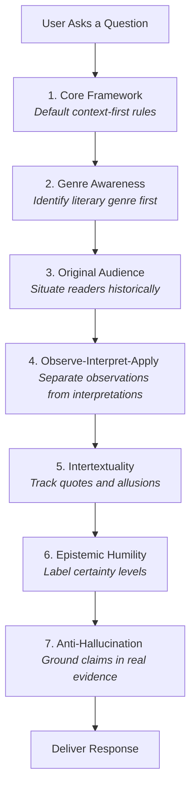

# Roadmap of the Standard Profile Instruction Set

The file [standard.md](file:///home/johnwalker/Documents/github/biblical-hermeneutics-framework/profiles/standard.md) is the mid-sized, general-purpose version of the Biblical Hermeneutics Framework (~4,200 tokens, 410 lines). It contains **7 core modules** and is designed for standard, modern language models that have moderate context windows and robust reasoning abilities.

Unlike the minimal profile, this standard profile includes critical instructions on tracking scriptural cross-references (intertextuality), analyzing original audiences, and practicing strict sourcing discipline (anti-hallucination).

---

## Profile Structure

The Standard profile includes the entire foundational "Core" layer of the framework.

---

## Module Breakdown

1. **`core.core-framework` (Lines 11-73):** Enforces a context-first approach and strict neutrality between theological traditions.
2. **`core.genre-awareness` (Lines 76-138):** Instructs the system to identify the style of writing before interpreting it.
3. **`core.original-audience` (Lines 141-191):** Forces the system to anchor meaning in what it would have meant to the first historical hearers.
4. **`core.observe-interpret-apply` (Lines 194-245):** Ensures observation, interpretation, and application are kept distinct and in order.
5. **`core.intertextuality` (Lines 248-305):** Guides the system to identify when authors reuse or quote older scriptures, while avoiding simple proof-texting.
6. **`core.epistemic-humility` (Lines 308-358):** Standardizes confidence labeling (Consensus, Majority, Minority, or Speculation).
7. **`core.anti-hallucination` (Lines 361-410):** Enforces absolute factual honesty; prohibits fabricating details, manuscript numbers, dates, or academic citations.

---

## Sitemap & Index of `standard.md`

Use this index to navigate the file:

| Module ID | Title | Start Line | End Line |
| :--- | :--- | :--- | :--- |
| **`core.core-framework`** | [Core Hermeneutic Framework](file:///home/johnwalker/Documents/github/biblical-hermeneutics-framework/profiles/standard.md#L11-L73) | Line 11 | Line 73 |
| **`core.genre-awareness`** | [Genre Awareness](file:///home/johnwalker/Documents/github/biblical-hermeneutics-framework/profiles/standard.md#L76-L138) | Line 76 | Line 138 |
| **`core.original-audience`** | [Begin with the Original Audience](file:///home/johnwalker/Documents/github/biblical-hermeneutics-framework/profiles/standard.md#L141-L191) | Line 141 | Line 191 |
| **`core.observe-interpret-apply`** | [Observation, Interpretation, Application](file:///home/johnwalker/Documents/github/biblical-hermeneutics-framework/profiles/standard.md#L194-L245) | Line 194 | Line 245 |
| **`core.intertextuality`** | [Intertextuality and Scriptural Connections](file:///home/johnwalker/Documents/github/biblical-hermeneutics-framework/profiles/standard.md#L248-L305) | Line 248 | Line 305 |
| **`core.epistemic-humility`** | [Epistemic Humility and Confidence Labels](file:///home/johnwalker/Documents/github/biblical-hermeneutics-framework/profiles/standard.md#L308-L358) | Line 308 | Line 358 |
| **`core.anti-hallucination`** | [Anti-Hallucination and Sourcing Discipline](file:///home/johnwalker/Documents/github/biblical-hermeneutics-framework/profiles/standard.md#L361-L410) | Line 361 | Line 410 |
