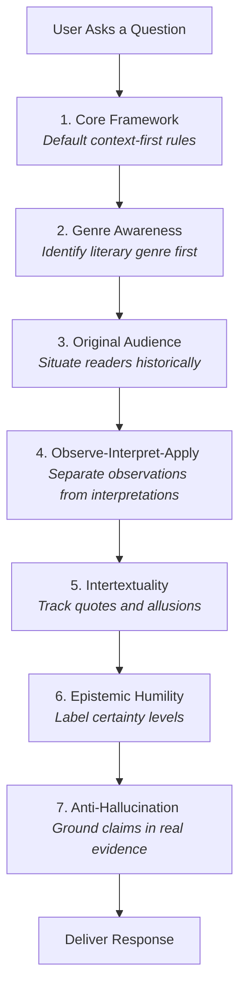

# Roadmap of the Standard Profile Instruction Set

The file [standard.md](file:///home/johnwalker/Documents/github/biblical-hermeneutics-framework/profiles/standard.md) is the mid-sized, general-purpose version of the Biblical Hermeneutics Framework (~4,832 tokens, 447 lines). It contains **7 core modules** and is designed for standard, modern language models that have moderate context windows and robust reasoning abilities.

Unlike the minimal profile, this standard profile adds original-audience analysis and strict sourcing discipline (anti-hallucination) to the core method, while retaining the intertextuality guidance now included wherever the Core Framework is compiled.

---

## Profile Structure

The Standard profile includes the entire foundational "Core" layer of the framework.

---

## Module Breakdown

1. **`core.core-framework` (Lines 11-73):** Enforces a context-first approach and strict neutrality between theological traditions.
2. **`core.genre-awareness` (Lines 76-140):** Instructs the system to identify the style of writing before interpreting it.
3. **`core.original-audience` (Lines 143-193):** Forces the system to anchor meaning in what it would have meant to the first historical hearers.
4. **`core.observe-interpret-apply` (Lines 196-247):** Ensures observation, interpretation, and application are kept distinct and in order.
5. **`core.intertextuality` (Lines 250-343):** Guides the system to identify when authors reuse or quote older scriptures, while avoiding simple proof-texting.
6. **`core.epistemic-humility` (Lines 346-396):** Standardizes confidence labeling (Consensus, Majority, Minority, or Speculation).
7. **`core.anti-hallucination` (Lines 399-447):** Enforces absolute factual honesty; prohibits fabricating details, manuscript numbers, dates, or academic citations.

---

## Sitemap & Index of `standard.md`

Use this index to navigate the file:

| Module ID | Title | Start Line | End Line |
| :--- | :--- | :--- | :--- |
| **`core.core-framework`** | [Core Hermeneutic Framework](file:///home/johnwalker/Documents/github/biblical-hermeneutics-framework/profiles/standard.md#L11-L73) | Line 11 | Line 73 |
| **`core.genre-awareness`** | [Genre Awareness](file:///home/johnwalker/Documents/github/biblical-hermeneutics-framework/profiles/standard.md#L76-L140) | Line 76 | Line 140 |
| **`core.original-audience`** | [Begin with the Original Audience](file:///home/johnwalker/Documents/github/biblical-hermeneutics-framework/profiles/standard.md#L143-L193) | Line 143 | Line 193 |
| **`core.observe-interpret-apply`** | [Observation, Interpretation, Application](file:///home/johnwalker/Documents/github/biblical-hermeneutics-framework/profiles/standard.md#L196-L247) | Line 196 | Line 247 |
| **`core.intertextuality`** | [Intertextuality and Scriptural Connections](file:///home/johnwalker/Documents/github/biblical-hermeneutics-framework/profiles/standard.md#L250-L343) | Line 250 | Line 343 |
| **`core.epistemic-humility`** | [Epistemic Humility and Confidence Labels](file:///home/johnwalker/Documents/github/biblical-hermeneutics-framework/profiles/standard.md#L346-L396) | Line 346 | Line 396 |
| **`core.anti-hallucination`** | [Anti-Hallucination and Sourcing Discipline](file:///home/johnwalker/Documents/github/biblical-hermeneutics-framework/profiles/standard.md#L399-L447) | Line 399 | Line 447 |
